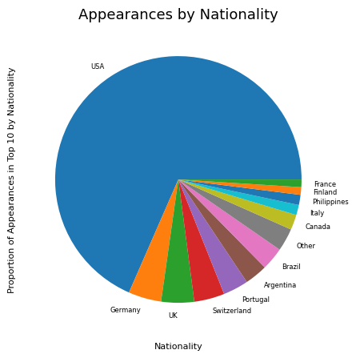
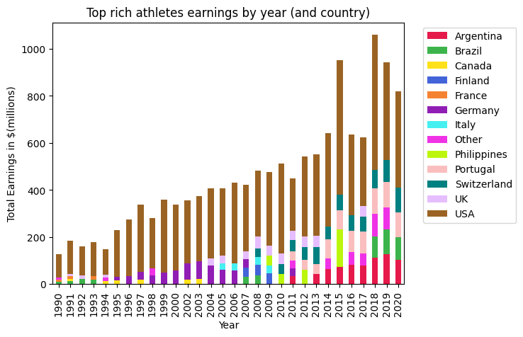
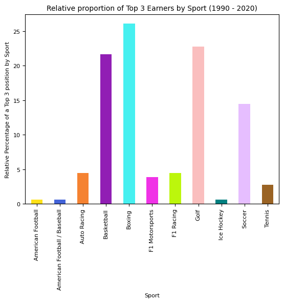
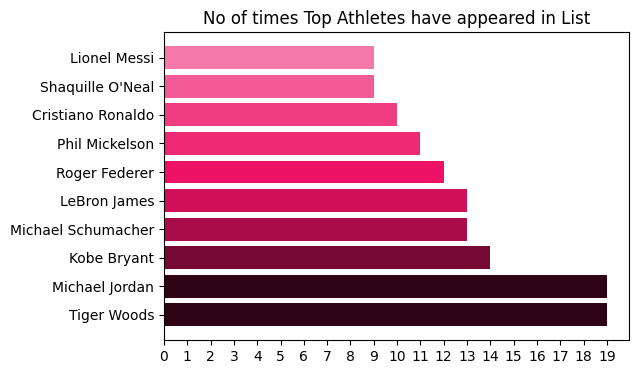

<!-- Output copied to clipboard! -->

<!-----

You have some errors, warnings, or alerts. If you are using reckless mode, turn it off to see inline alerts.
* ERRORs: 0
* WARNINGs: 0
* ALERTS: 10

Conversion time: 2.08 seconds.

Using this Markdown file:

1. Paste this output into your source file.
2. See the notes and action items below regarding this conversion run.
3. Check the rendered output (headings, lists, code blocks, tables) for proper
   formatting and use a linkchecker before you publish this page.

Conversion notes:

* Docs to Markdown version 1.0β34
* Thu Feb 16 2023 05:10:08 GMT-0800 (PST)
* Source doc: EDA_docCaptstoneIV
* Tables are currently converted to HTML tables.
* This document has images: check for >>>>>  gd2md-html alert:  inline image link in generated source and store images to your server. NOTE: Images in exported zip file from Google Docs may not appear in  the same order as they do in your doc. Please check the images!

----->

>>>>>  gd2md-html alert:  ERRORs: 0; WARNINGs: 0; ALERTS: 10.

<ul style="color: red; font-weight: bold"><li>See top comment block for details on ERRORs and WARNINGs. <li>In the converted Markdown or HTML, search for inline alerts that start with >>>>>  gd2md-html alert:  for specific instances that need correction.</ul>

Links to alert messages:
<a href="#gdcalert1">alert1</a>
<a href="#gdcalert2">alert2</a>
<a href="#gdcalert3">alert3</a>
<a href="#gdcalert4">alert4</a>
<a href="#gdcalert5">alert5</a>
<a href="#gdcalert6">alert6</a>
<a href="#gdcalert7">alert7</a>
<a href="#gdcalert8">alert8</a>
<a href="#gdcalert9">alert9</a>
<a href="#gdcalert10">alert10</a>

>>>>> PLEASE check and correct alert issues and delete this message and the inline alerts.

>>>>>  gd2md-html alert: inline image link here (to images/image1.png). Store image on your image server and adjust path/filename/extension if necessary.  (<a href="#">Back to top</a>)(<a href="#gdcalert2">Next alert</a>) >>>>> 

**TASK**

**Exploratory Data Analysis on the Forbes Richest Athletes Dataset**

>>>>>  gd2md-html alert: inline image link here (to images/image2.jpg). Store image on your image server and adjust path/filename/extension if necessary.  (<a href="#">Back to top</a>)(<a href="#gdcalert3">Next alert</a>) >>>>> 

**Introduction**

**DATA CLEANING and SUMMARY of DATA**

An initial view of the data shows we have 301 entries and 8 data items, one of which is a numeric ID.  The data is split into 3 numeric and 4 object (text based) features.  Of these, 'Sport' and 'Nationality' are categorical variables, as is 'Name', as there are separate entries for individual athletes (presumably one for each year they appeared in the list). 'Previous Year Rank' is storing a mix of numbers and characters and may contain nulls.  Of the numeric features (ignoring 'S.NO', 'Current Rank' could also be regarded as categorical as could 'Year'. 'earning ($ million)' is float type and is the key data item of interest that will mostly be unique.)

# **MISSING DATA**

A quick look at nulls in the data shows there are considerable null values in the 'Previous Year Rank' feature.  This is normal as this feature may well be blank if an athlete hasn't appeared before, and so therefore no imputation is needed here. For the remaining data, I am going to look for unique values in the categorical fields to see if they are consistent. 

 

From looking at the full output in the text editor, I can see a few issues. In the 'Names' feature, it seems like 'Aaron Rodgers' and 'Aaron Rogers' may be the same person.  In the 'Year' category, 2001 is missing. In the 'Sport' category there are a number of repeated categories because they haven't been capitalised.  There are some entries listed with a nationality of 'Filipino' that should be 'Philippines'. 

  

I am going to create a new dataframe and first capitalise the 'Sport' feature.  I am also going to change 'Aaron Rogers' to 'Aaron Rodgers' having checked to see if this is an error, and I will change the ‘Nationality’ feature containing 'Filipino' to 'Philippines'.  Having cleaned the data, but still with 2001 missing, I am going to proceed with the analysis.

# **DATA STORIES AND VISUALISATIONS**

<table>
  <tr>
   <td>

>>>>>  gd2md-html alert: inline image link here (to images/image3.png). Store image on your image server and adjust path/filename/extension if necessary.  (<a href="#">Back to top</a>)(<a href="#gdcalert4">Next alert</a>) >>>>> 

   </td>
   <td>The graphic to the left shows a plot of the average earnings of the top 10 athletes over the 30-year period.  

 

It’s interesting to see the significant dips and rises in the periods spanning 2015-2020.  The drop in 2020 may be explained by the COVID outbreak even though they may not directly coincide, but the other fluctuations may need further explanation but are probably similarly economically linked.
   </td>
  </tr>
</table>

<table>
  <tr>
   <td>

>>>>>  gd2md-html alert: inline image link here (to images/image4.png). Store image on your image server and adjust path/filename/extension if necessary.  (<a href="#">Back to top</a>)(<a href="#gdcalert5">Next alert</a>) >>>>> 

   </td>
  </tr>
  <tr>
   <td>The above graphic shows the distributions of earnings between Nations over the 30-year period.  It should follow the line graph above but with the added feature of seeing the nations with a higher proportion of the revenue.  Out of the 20 nations listed, I have put the lowest 8 into the category of ‘other’.  Obviously, the USA is accounting for much of the revenue over the entire period but it is interesting to note how Brazil has appeared significantly in the last 3 years.  Perhaps this has some political connections. Argentina has also fared well during the last 7 or eight years of the data span.    
   </td>
  </tr>
</table>

<table>
  <tr>
   <td>

>>>>>  gd2md-html alert: inline image link here (to images/image5.png). Store image on your image server and adjust path/filename/extension if necessary.  (<a href="#">Back to top</a>)(<a href="#gdcalert6">Next alert</a>) >>>>> 

   </td>
  </tr>
  <tr>
   <td>The pie chart above shows how heavily the data is weighted by USA nationality.
   </td>
  </tr>
</table>

<table>
  <tr>
   <td>

>>>>>  gd2md-html alert: inline image link here (to images/image6.png). Store image on your image server and adjust path/filename/extension if necessary.  (<a href="#">Back to top</a>)(<a href="#gdcalert7">Next alert</a>) >>>>> 

   </td>
  </tr>
  <tr>
   <td>From the above Bar chart, we can see the athletes with the largest number of appearances in the list over the 30 years. Michael Jordan (basketball) and Tiger Woods (golf) have both appeared in the list a total of 19 different years (excluding 2001 of course which is missing from the data).  One question raised from this is whether they were actually competing in all of these years or whether it just represents a massive income in that year by still being associated with the sport, as in Tiger Woods’ case, he did have a while not playing.
   </td>
  </tr>
</table>

<table>
  <tr>
   <td>

>>>>>  gd2md-html alert: inline image link here (to images/image7.png). Store image on your image server and adjust path/filename/extension if necessary.  (<a href="#">Back to top</a>)(<a href="#gdcalert8">Next alert</a>) >>>>> 

   </td>
   <td>This bar chart shows a measure of the top 3 athletes' (in wealth) nationalities over the 30-year period. If the athlete’s ranking was 1 then they are given a score of 3, 2 if second and 1 if third.  These are then totalled by sport and proportionality as a percentage.  It doesn’t necessarily give a proportion of total earnings but a proportion of how often an athlete representing that sport appears in the top 3 earners. So you will see some similarities between this graph and the graph below, but with differences. For example, here boxing  appears much higher than basketball, implying that although there may be more money in basketball, boxing is still clearly well paid and there are likely to be more very wealthy ex-boxes than ex-basketball players.
   </td>
  </tr>
  <tr>
   <td colspan="2" >

>>>>>  gd2md-html alert: inline image link here (to images/image8.png). Store image on your image server and adjust path/filename/extension if necessary.  (<a href="#">Back to top</a>)(<a href="#gdcalert9">Next alert</a>) >>>>> 

   </td>
  </tr>
  <tr>
   <td colspan="2" >Perhaps this is one of the most informative graphs in terms of the money in different sports as it is giving the total earnings over the 30-year period.  The graph has a distinctly descending slope.  Basketball is predominantly a U.S. sport and they are by far the most common nationality in the list so this is not a big surprise from the theme of the data.  It is interesting to note that total earnings from the three sports of Boxing, Soccer and Golf are all considerably high and are more widely played internationally.  The final graph on the next page shows a breakdown of these by nationality.
   </td>
  </tr>
  <tr>
   <td colspan="2" >

>>>>>  gd2md-html alert: inline image link here (to images/image9.png). Store image on your image server and adjust path/filename/extension if necessary.  (<a href="#">Back to top</a>)(<a href="#gdcalert10">Next alert</a>) >>>>> 

   </td>
  </tr>
  <tr>
   <td colspan="2" >Contrary to what I said above, this graph shows the prominent earners in Boxing and Golf are of US nationality.  However, what this graph does show is that soccer is the most rewarding sport that has minimal US participation.  Portugal and Argentina feature strongly in this category probably due to Ronlado(Portugal) and Messi(Argentinian) both appearing in the list on many occasions.  U.K and Brazil also feature significantly here and this can be explained by the fact many top Brazilian players play in the European leagues where wages are high, or in the UK which boasts one of the most entertaining and wealthiest leagues in the world.
   </td>
  </tr>
</table>

**THIS REPORT WAS WRITTEN BY: Paul Aughterson**

>>>>>  gd2md-html alert: inline image link here (to images/image10.jpg). Store image on your image server and adjust path/filename/extension if necessary.  (<a href="#">Back to top</a>)(<a href="#gdcalert11">Next alert</a>) >>>>> 

